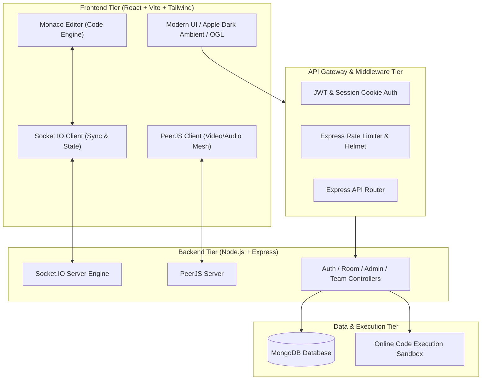
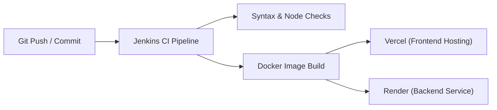

# CodeTMC — Comprehensive Feature & Technology Stack Technical Report

> **Project Name:** CodeTMC (Collaborative Developer Environment & Real-Time Studio)  
> **Repository:** `Diinesh06082005/codetmc-v3`  
> **Date:** August 2026  
> **Target Audience:** Engineering Leads, System Architects, Developers & Stakeholders  

---

## 1. Executive Summary & System Architecture

**CodeTMC** is an enterprise-grade, real-time collaborative code editor and workspace platform built on the **MERN** stack architecture (MongoDB, Express, React, Node.js). Designed for modern developer teams, pair programming sessions, technical interviews, and remote code reviews, CodeTMC combines low-latency real-time code synchronization with integrated peer-to-peer WebRTC video calling, visual Git history scrubbing, online multi-language code compilation, live web previews, and an admin command center for platform surveillance and analytics.



---

## 2. Complete Technology Stack Matrix

| Category | Primary Technology | Version / Tooling | Purpose & Specific Role |
| :--- | :--- | :--- | :--- |
| **Frontend Framework** | React | `^18.3.1` | Component-driven user interface and dynamic state management |
| **Build Tool & Bundler** | Vite | `^6.0.5` | Hyper-fast HMR module bundling and build optimization |
| **Routing** | React Router DOM | `^6.28.1` | Client-side routing, protected route guards, and URL parameters |
| **State Management** | Context API | Native React | Global AuthContext, BroadcastContext, Theme, & Workspace states |
| **Code Editor Engine** | Monaco Editor | `@monaco-editor/react ^4.6.0` | VS Code-powered browser code editing with multi-language linting |
| **Real-Time Engine** | Socket.IO | `^4.8.1` (Client & Server) | WebSocket event bi-directional broadcasting for room sync |
| **Video & Audio Calling** | PeerJS / WebRTC | `peerjs ^1.5.5` / `peer ^1.0.2` | Multi-party P2P audio, camera video streams, and screen sharing |
| **UI Styling & Theme** | Tailwind CSS | `^3.4.17` + PostCSS | Glassmorphism, responsive grid design, Apple Dark Ambient theme |
| **Animations & WebGL** | Framer Motion & GSAP & OGL | `^11.15.0` / `^3.15.0` / `^1.0.11` | Micro-interactions, smooth page transitions, interactive 3D mesh background |
| **Data Visualization** | Recharts | `^3.8.1` | Admin telemetry dashboards, active session graphs, system health charts |
| **Backend Runtime** | Node.js | v18+ | High-throughput asynchronous server platform |
| **Web Server Framework**| Express.js | `^4.21.2` | RESTful API routing, middleware execution, static serving |
| **Database & ORM** | MongoDB + Mongoose | `^8.9.5` | NoSQL document storage, schemas for Users, Rooms, Teams, Broadcasts |
| **Authentication & Tokens**| JWT + Bcryptjs | `jsonwebtoken ^9.0.3` / `bcryptjs ^3.0.3` | Stateless session signing, salted password hashing |
| **Security & Headers** | Helmet & Rate Limit | `helmet ^8.0.0` / `express-rate-limit ^8.3.2` | Anti-XSS, security headers, brute-force API/Socket rate limiting |
| **Input Validation** | Validator.js | `^13.15.35` | Strict payload validation and input sanitization |
| **DevOps & Containers** | Docker & Docker Compose | Docker Engine | Containerized deployments for Server, Client, and Jenkins CI |
| **CI/CD Pipeline** | Jenkins | Jenkinsfile / Dockerfile.jenkins | Automated build testing, syntax verification, and deployment pipelines |
| **Cloud Hosting** | Vercel & Render | `vercel.json` / `render.yaml` | Frontend Vercel edge distribution & Backend Render cloud deployment |

---

## 3. Major & Medium Features Catalog

### 🚀 3.1. Real-Time Collaborative Code Synchronization (Major)
* **Monaco Editor Integration:** Embedded VS Code core editor supporting JavaScript, TypeScript, Python, C++, Java, HTML, CSS, JSON, and Markdown syntax highlighting.
* **Delta Broadcast & Operational Sync:** Instant code changes emitted through Socket.IO with minimal payload footprint (`code-change`, `sync-code`), guaranteeing synchronized state across concurrent users in a room.
* **Live Remote Presence & Typing Indicators:** Displays active room users, active line cursors, typing notifications, and joining/leaving activity logs in real time.
* **Multi-File Workspace Explorer:** Tree-structured file management system (`FileExplorer.jsx`) inside room workspaces for creating, opening, editing, and saving multiple files.

### 🎥 3.2. WebRTC Video Calling, Audio Broadcasts & Voice Notes (Major)
* **Peer-to-Peer Video Calling:** Full mesh WebRTC video architecture via PeerJS (`VideoChat.jsx`, `VideoCallSettingsModal.jsx`), supporting webcam streaming, mic toggles, and screen sharing.
* **Voice Notes Recording & Playback:** Integrated audio recorder allowing users to record voice clips in room chat and stream playback (`VoiceNotePlayer.jsx`).
* **Global Admin Surveillance & Broadcast System:** "God-mode" administrator capability to view/listen to live video/audio streams across active project rooms (`BroadcastSideBox.jsx`, `BroadcastContext.jsx`).

### 🌿 3.3. Git History Management, Branching & Time-Travel Scrubbing (Major)
* **Git Branch Manager:** Interactive branch creation, branch switching, and commit tree navigation (`GitBranchManager.jsx`).
* **Chapter Scrubber (Time Travel Debugging):** Timeline scrubber (`ChapterScrubber.jsx`) enabling developers to scrub back and forth through historical code snapshots and reconstruct room history.
* **Pull Request Workflow:** Integrated Pull Request creation modal (`PullRequestModal.jsx`), allowing code submission, revision notes, diff comparisons, and merge approvals inside the workspace.
* **Revision Audit Log:** Detailed history log (`HistoryLog.jsx`) recording timestamped user actions, code edits, and branch commits.

### 🔒 3.4. Authentication, Authorization & Security Infrastructure (Major)
* **Dual-Layer Session Authentication:** User login/registration powered by JSON Web Tokens (JWT) stored securely in `httpOnly`, `SameSite`, and `Secure` HTTP cookies (`AUTH_COOKIE_NAME`).
* **Role-Based Access Control (RBAC):** Access control differentiating standard `User` accounts from elevated `Admin` privileges.
* **Client & Backend Guards:** Frontend `ProtectedRoute` component paired with server-side `authMiddleware` to block unauthorized room entry or administrative action.
* **Admin Bootstrap Utility:** CLI command (`npm run create-admin`) to securely create or elevate initial administrator credentials with hashed passwords.

### 💻 3.5. Online Multi-Language Code Compilation & Live Web Sandbox (Medium)
* **Code Compiler Engine:** Integrated playground component (`CompilerPlayground.jsx`) hooked into an execution service (`online-code-compiler`) to compile and execute languages (Node.js, Python, C++) with stdout/stderr reporting.
* **Live Web Preview:** Sandboxed iframe renderer (`LiveWebPreview.jsx`) providing real-time rendering for HTML/CSS/JavaScript web code edits directly within the browser window.

### 📊 3.6. Admin Command Center & System Analytics (Medium)
* **Platform Telemetry Dashboard:** Responsive administrative panel (`AdminDashboard.jsx`) displaying total users, active rooms, socket connections, and system load.
* **Interactive Data Visualization:** Dynamic analytics powered by Recharts (`recharts`), charting usage stats, error rates, and connection activity.
* **User & Session Management:** Admin functionality to audit accounts, inspect active room sessions, force disconnect sockets, or terminate accounts with guarded delete flows.

### 👥 3.7. Team Workspace & Workspace Invitations (Medium)
* **Team Management Model:** MongoDB `Team` and `TeamInvitation` schemas allowing users to group into enterprise organizations, assign roles, and issue invitation tokens.
* **Join Room Modals:** Quick join and create room flows (`JoinRoomModal.jsx`, `CreateRoomModal.jsx`) supporting passcodes, room locking, and customizable environment settings.

### 🎨 3.8. Apple Dark Ambient UI & Motion System (Medium)
* **Fluid Animated Background:** High-performance WebGL/OGL interactive gradient canvas background (`AnimatedBackground.jsx`).
* **Glassmorphism & Micro-Animations:** Apple-inspired dark ambient UI with backdrop blur filters, floating island navigation header/sidebar (`Header.jsx`, `Sidebar.jsx`), hover micro-interactions, and developer typing visual effects (`DeveloperTypingAnimation.jsx`).
* **Responsive Layout:** Adaptive structural layout for widescreen monitors down to tablet and mobile screens.

---

## 4. API & Socket Architecture

### 4.1. Core REST API Endpoints

```text
Authentication Routes (/api/auth)
  POST   /api/auth/register    - Register new user account
  POST   /api/auth/login       - Authenticate credentials & issue session cookie
  POST   /api/auth/logout      - Invalidate session cookie & disconnect socket
  GET    /api/auth/me          - Restore session metadata for boot verification

Room Routes (/api/rooms)
  POST   /api/rooms            - Create new collaborative workspace room
  GET    /api/rooms/:roomId    - Fetch room details, active users, and code snapshot
  POST   /api/rooms/:roomId/join - Authorize user entry into protected room

Admin Routes (/api/admin)
  GET    /api/admin/stats      - Fetch system health & real-time telemetry metrics
  GET    /api/admin/users      - List all registered users
  GET    /api/admin/users/:id  - Get user detail profile & session history
  DELETE /api/admin/users/:id  - Admin deletion of target user account

Team & Code Compilation Routes (/api/teams, /api/compile)
  POST   /api/teams            - Create team entity
  POST   /api/compile          - Execute code string against sandbox compiler
```

### 4.2. Socket.IO Event Matrix

| Event Name | Direction | Payload | Description |
| :--- | :--- | :--- | :--- |
| `join-room` | Client $\rightarrow$ Server | `{ roomId, user }` | Joins socket room and triggers room state fetch |
| `user-joined` | Server $\rightarrow$ Client | `{ user, roomUsers }` | Notifies active members of a new user joining |
| `code-change` | Client $\leftrightarrow$ Server | `{ roomId, code, fileId }` | Syncs delta code edits instantly across all socket clients |
| `chat-message` | Client $\leftrightarrow$ Server | `{ roomId, message, sender, timestamp }` | Broadcasts text or voice clip payload to room chat |
| `typing` | Client $\leftrightarrow$ Server | `{ roomId, username, isTyping }` | Displays active typing notification indicator |
| `sync-code` | Server $\rightarrow$ Client | `{ code }` | Forces full code editor state sync upon client request |
| `leave-room` | Client $\rightarrow$ Server | `{ roomId }` | Cleans up socket room membership and presence |

---

## 5. DevOps, CI/CD & Deployment Strategy



* **Docker & Containerization:** Production `Dockerfile` and `docker-compose.yml` configurations for running isolated frontend and backend services.
* **Jenkins Automation:** Dedicated `Jenkinsfile` and `Dockerfile.jenkins` automating static verification, backend `node --check` syntax validation, and Vite frontend production compilation tests.
* **Cloud Architecture:** Configured for Vercel edge deployment (`vercel.json`) serving the single-page application frontend, with backend web services and WebSockets hosted on Render (`render.yaml`).

---

## 6. Summary Conclusion

CodeTMC delivers an enterprise developer environment by bridging low-latency real-time editing with WebRTC media streams, visual version control tools, and administrative oversight. Its modular architecture ensures scalability, security, and a visual aesthetic tailored for high-productivity software development teams.
