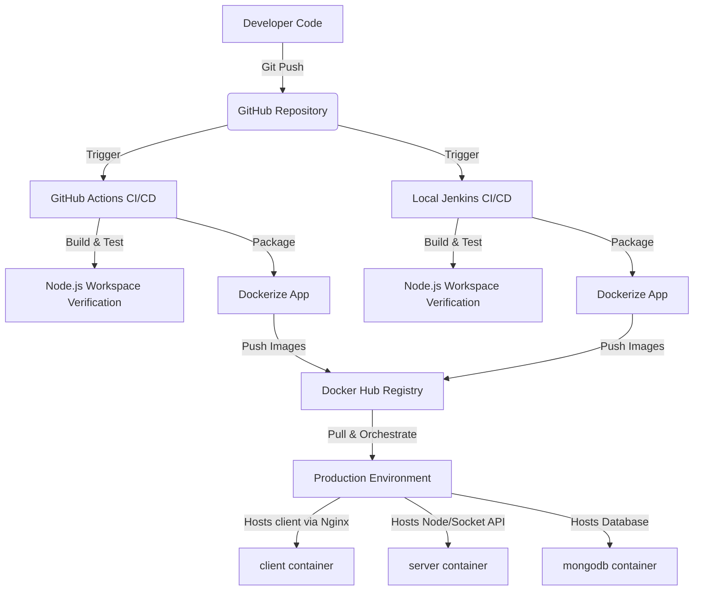

# 🛠️ DevOps Reference Manual: codetmc

This document serves as a comprehensive guide to the DevOps infrastructure, tools, and workflows implemented for the **codetmc** full-stack monorepo application.

---

## 🗺️ Architecture Overview

The following diagram illustrates how the DevOps tools cooperate to manage, build, test, and deploy the application:

---

## 🧰 DevOps Tools Summary

| Tool | Category | Why We Used It | How It Is Used in the Project |
| :--- | :--- | :--- | :--- |
| **Docker** | Containerization | Ensures "works on my machine" consistency across development, testing, and production. | Package backend (`server`) and frontend (`client`) into lightweight, isolated containers. |
| **Docker Compose** | Container Orchestration | Simplifies running multi-container applications with a single command. | Manages the application stack (`server`, `client`, `mongodb`) and the `jenkins` local server. |
| **GitHub Actions** | Cloud CI/CD | Automates build validation and Docker Hub deployment on every push/pull request directly in the cloud. | Executes lint/build checks and pushes production images on updates to `main`. |
| **Jenkins** | On-Premises CI/CD | Provides complete control over the build environment, custom integration agents, and deployment servers. | Runs custom pipeline scripts (`Jenkinsfile`) locally or on private server infrastructure. |
| **Nginx** | Web Server / Proxy | Efficiently serves static frontend assets and handles routing for Single Page Applications (SPA). | Acts as the web server inside the `client` Docker image, serving Vite build assets. |
| **npm Workspaces** | Monorepo Management | Manages multiple packages (frontend/backend) in a single repository with shared dependencies. | Resolves and links packages from the root `package.json` for server & client directories. |

---

## 🛠️ Tool-by-Tool Guide & Configuration

### 1. Docker & Docker Compose
* **`server/Dockerfile`**: A lightweight Node-Alpine container that installs production-only dependencies using npm workspaces and runs `npm start -w server`.
* **`client/Dockerfile`**: A multi-stage build. Stage 1 compiles the Vite React assets with production environment variables (`VITE_API_URL`, `VITE_SOCKET_URL`). Stage 2 copies those static assets to an Nginx server.
* **`docker-compose.yml`**: Orchestrates the DB (`mongodb`), backend API (`server` on port `5000`), and static frontend web server (`client` on port `8080`).

### 2. GitHub Actions
* **Configuration File**: `.github/workflows/ci-cd.yml`
* **Workflow Steps**:
  1. Checks out the code.
  2. Sets up Node.js v20.
  3. Installs dependencies using `npm ci`.
  4. Builds frontend assets via `npm run build` to verify compilation.
  5. Logs in to Docker Hub.
  6. Builds and publishes Docker images tagged with `latest` and the unique Git Commit SHA.

### 3. Jenkins
* **Configuration File**: `Jenkinsfile` (uses Declarative Pipeline syntax)
* **Custom Runner**: Configured via `Dockerfile.jenkins` and `docker-compose.jenkins.yml` to run Jenkins on host port `8090`, sharing the host's Docker socket `/var/run/docker.sock` so it can run Docker builds internally.

---

## ✅ Verification and Troubleshooting

### How to Verify Docker Containers are Working:
Run `docker ps` and check that all three containers (`codetmc-client`, `codetmc-server`, `codetmc-mongodb`) are in `Up` status. Access the app at `http://localhost:8080`.

### How to Verify GitHub Actions:
Go to the **Actions** tab of your repository on GitHub. Look for the green checkmark next to your latest commit. Check the step output for `Log in to Docker Hub` and `Build and Push` stages.

### How to Verify Jenkins:
Open `http://localhost:8090` and verify that your build completed successfully. Green bars in the "Stage View" represent successful checkouts, dependency installations, builds, and pushes.

---

## 📋 Commands Cheat Sheet

Here is a list of all commands used to manage the development and DevOps lifecycle in this project:

### Docker & Container Management
| Command | Action |
| :--- | :--- |
| `docker compose up -d` | Starts the client, server, and mongodb services in background mode. |
| `docker compose down` | Stops and removes all application containers. |
| `docker compose logs -f` | Follows logs from all running services. |
| `docker compose logs -f server` | Follows logs for the backend container only. |
| `docker ps` | Lists all currently running containers. |
| `docker stop <container_name>` | Safely stops a specific running container. |
| `docker rm <container_name>` | Removes a stopped container. |
| `docker image prune -f` | Cleans up unused dangling images to free disk space. |

### Local Jenkins Management
| Command | Action |
| :--- | :--- |
| `docker compose -f docker-compose.jenkins.yml up -d --build` | Builds the custom Jenkins image and starts it in the background. |
| `docker compose -f docker-compose.jenkins.yml down` | Stops the local Jenkins server. |
| `docker exec codetmc-jenkins cat /var/jenkins_home/secrets/initialAdminPassword` | Prints the initial setup admin password for Jenkins. |

### Git & GitHub Operations
| Command | Action |
| :--- | :--- |
| `git init` | Initializes a new local Git repository. |
| `git remote add origin <repo_url>` | Links the local repository to a remote repository. |
| `git add .` | Stages all changes (excluding files listed in `.gitignore`). |
| `git commit -m "commit message"` | Commits staged changes with a descriptive message. |
| `git branch -M main` | Renames the current branch to `main`. |
| `git push -u origin main` | Pushes local changes to the remote repository and sets tracking. |
| `git push -f origin main` | Force-pushes local changes (overwriting remote history). |

### Port & Networking (Windows PowerShell)
| Command | Action |
| :--- | :--- |
| `netstat -ano \| findstr :5000` | Identifies which Process ID (PID) is listening on port 5000. |
| `tasklist \| findstr "<PID>"` | Finds the process name running under a specific PID. |
| `Stop-Process -Id <PID> -Force` | Force terminates a process by PID to free up a port. |
