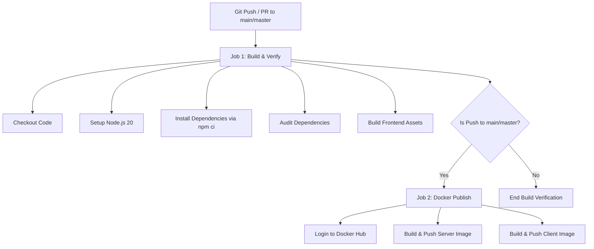

# GitHub Actions CI/CD Pipeline Implementation Guide

This guide details the structure and setup requirements for the GitHub Actions CI/CD workflow defined in `.github/workflows/ci-cd.yml`.

---

## 🚀 Workflow Overview

The GitHub Actions workflow automates integration and deployment tasks:

---

## 🛠️ Key Fixes Applied

In the server/client Docker build steps, the build context has been corrected:
* **Old Behavior:** Context was set to `./server` and `./client` individually.
* **New Behavior:** Context is set to the monorepo root (`.`).
* **Why?** Both the `server/Dockerfile` and `client/Dockerfile` copy monorepo root files (`package*.json`) and use workspaces directory structures. Setting the context to the root prevents build-time file resolution failures.

---

## 🔑 GitHub Secrets Configuration

For the **docker-publish** job to run successfully on a push event, you must configure the following repository secrets in your GitHub repository:

| Secret Name | Description | Example Value |
| :--- | :--- | :--- |
| `DOCKER_USERNAME` | Your Docker Hub account username | `dineshkumar` |
| `DOCKER_PASSWORD` | Docker Hub Personal Access Token (PAT) | `dckr_pat_...` |
| `PRODUCTION_API_URL` | Production server URL passed to Client Vite build | `https://api.codetmc.com` |
| `PRODUCTION_SOCKET_URL` | Production Socket.io server URL passed to Client Vite build | `https://api.codetmc.com` |

### How to add Secrets on GitHub:
1. Navigate to your repository on GitHub.
2. Click on **Settings** -> **Secrets and variables** -> **Actions**.
3. Click the **New repository secret** button.
4. Input the **Name** and **Value** for each item listed in the table above, then click **Add secret**.

---

## 🔄 Running and Verifying

1. **Triggering the Pipeline:**
   * A **Pull Request** targeting `main` or `master` will trigger the **Build & Verify** job (Job 1) to validate the code compiles.
   * A direct **Push** or merge to `main` or `master` will run **Build & Verify** followed by the **Docker Publish** job (Job 2), pushing the updated images to your Docker Hub registry.

2. **Monitoring Progress:**
   * Go to the **Actions** tab on your GitHub repository.
   * Click on the running workflow run to view step-by-step logs and status.
